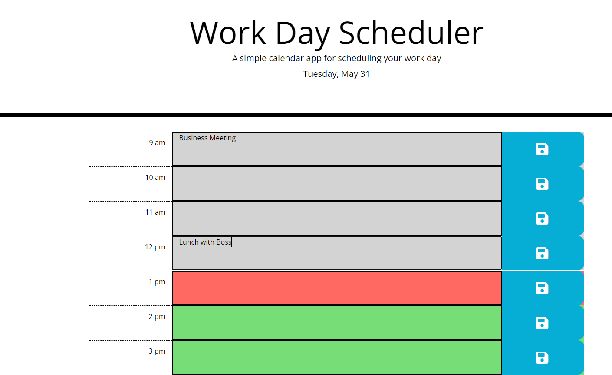

## Purpose
A simple calendar that allows a user to save events for each hour of the day. This application utilizes moment.js, bootstrap, and jquery. Local storage saves text and time-blocks are dynamic depending upon the hour of the day. Each block is colored grey, red, or green and represents past, present, and future times respectively.  

## Screenshot

## Deployed URL: 
<https://smith-utxo.github.io/Work-Day-Scheduler/>

## Legal Notice
 © Adam T. Smith, U of M Coding Boot Camp 

Licensed under the [MIT license](LICENSE)

## Contributors 
- Adam T. Smith <smith.adam937@gmail.com> 
